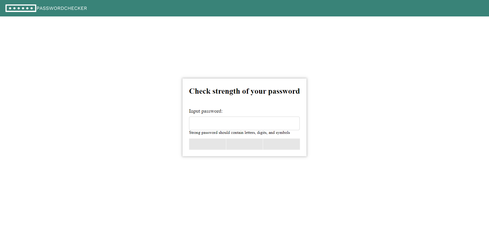
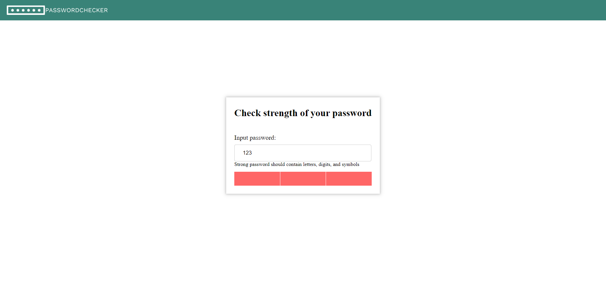
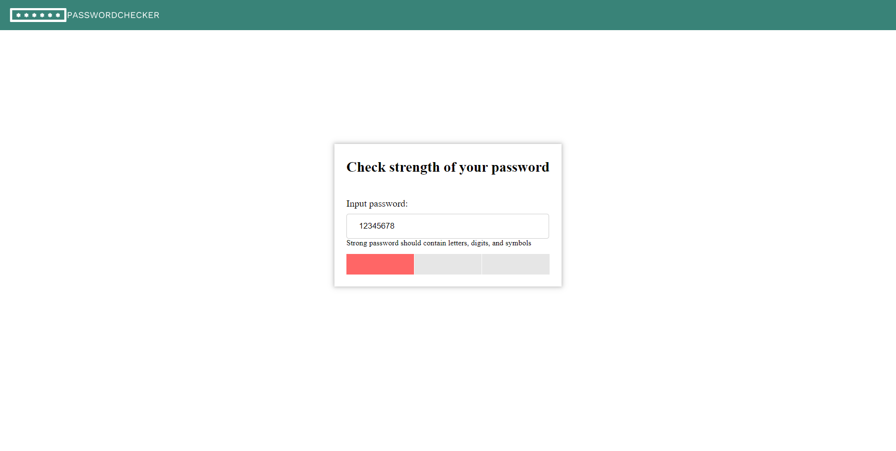
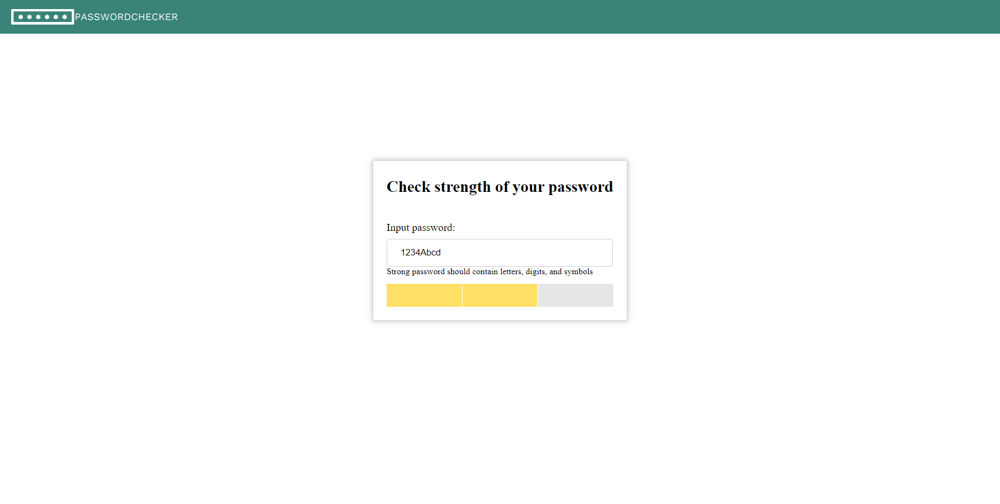
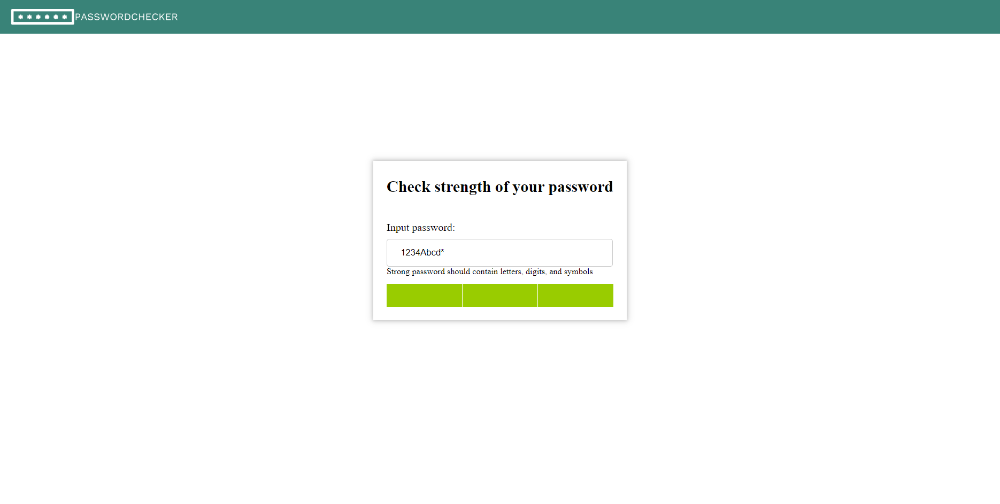

# PasswordChecker

PasswordChecker is an Angular application designed to assess the strength of passwords. This application provides a visual representation of the password strength using three color-coded sections.

## Password Strength Criteria

The password strength is represented using the following color-coded sections:

- Gray Sections (Empty Field): If the password field is empty, all sections are displayed in gray.
- Red Sections (Short Password): If the password contains fewer than 8 characters, all sections are displayed in red.
- Red Section (Easy Password): If the password is considered easy, only the first section is displayed in red, and the rest are gray.
- Yellow Sections (Medium Password): If the password is of medium strength, the first two sections are displayed in yellow, and the last one is gray.
- Green Sections (Strong Password): If the password is strong, all sections are displayed in green.

## Prerequisites

Before running the PasswordChecker application, ensure you have the following prerequisites installed on your system:

- Node.js
- Angular CLI

## Installation

1. Clone the repository: `git clone https://github.com/marharita08/PasswordChecker`
2. Navigate to the project directory: `cd PasswordChecker`
3. Install the dependencies: `npm install`

## Usage

1. Run the development server: `ng serve`
2. Open your browser and visit: `http://localhost:4200`

## Screenshots

